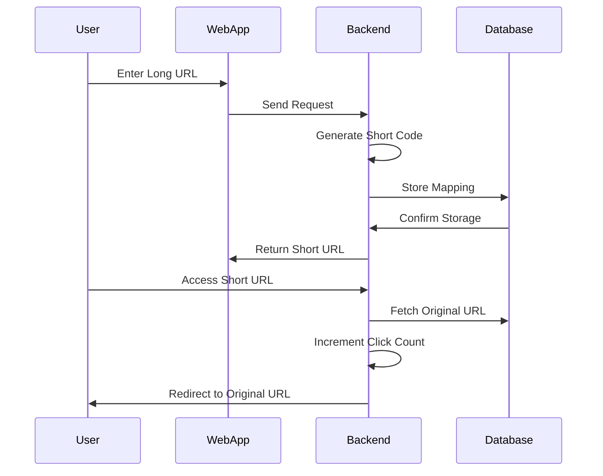
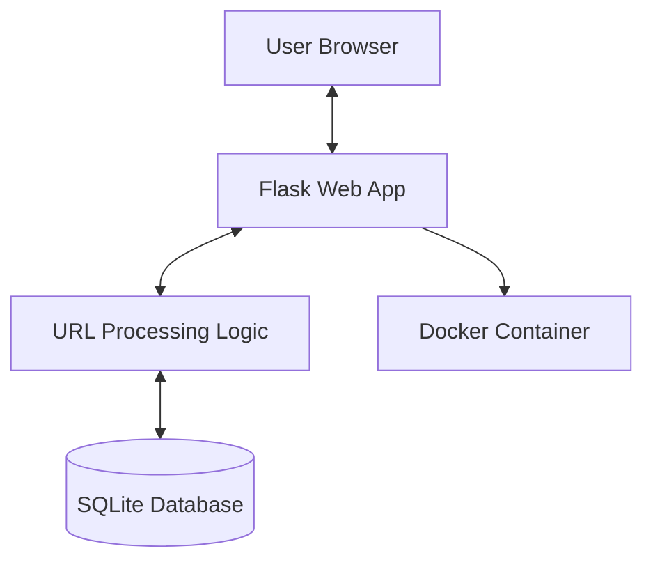

## 🔗 URL Shortener (Flask + Docker Implementation)

**URL Shortener** is a lightweight web application that converts long URLs into short, shareable links. It also tracks usage analytics such as click counts and ensures efficient URL management using a simple database.

This project demonstrates a production-style implementation using **Flask, SQLite, and Docker**, designed for scalability and ease of deployment.

---

## 💡 How URL Shortener Works



---

### 🔄 Key Workflow Steps

1. **User Input**: User submits a long URL through the web interface
2. **Short Code Generation**: Backend generates a unique short code
3. **Database Storage**: Mapping between short and original URL is stored
4. **Short URL Creation**: A shortened URL is returned to the user
5. **Redirection**: Accessing the short URL redirects to the original link
6. **Analytics Tracking**: Click count is updated for each visit

---

### ⚙️ Important Characteristics

* Short URLs are **unique and randomly generated**
* Database ensures **persistent storage**
* Duplicate URLs are handled efficiently
* Click tracking provides **basic analytics**
* Application is fully **containerized using Docker**

---

## 🏗️ System Architecture



---

## 🔧 Component Breakdown

### 1. **Flask Application (`app.py`)**

* Handles HTTP requests (GET/POST)
* Generates short URLs
* Manages redirection logic
* Updates click analytics

---

### 2. **Database (SQLite)**

* Stores:

  * Short Code
  * Original URL
  * Click Count
* Lightweight and easy to use

---

### 3. **Frontend (`index.html`)**

* Simple user interface
* Accepts long URL input
* Displays short URL and stats

---

### 4. **Docker**

* Containerizes the application
* Ensures consistent runtime environment
* Simplifies deployment

---

## ✨ Key Features

* 🔗 URL shortening
* 🔁 Redirection to original URL
* 📊 Click tracking (analytics)
* ♻️ Duplicate URL handling
* 💾 Persistent storage using SQLite
* 🐳 Docker support

---

## 🔌 API Endpoints

### 1. Home Page

```bash
GET /
```

---

### 2. Create Short URL

```bash
POST /
```

**Input:**

```bash
url=<long_url>
```

---

### 3. Redirect URL

```bash
GET /<short_code>
```

---

### 4. View Statistics

```bash
GET /stats
```

---

## 🛠️ Setup and Installation

### 📋 Prerequisites

* Python 3.x
* Docker

---

### 🔧 Installation Steps

#### 1. Clone Repository

```bash
git clone https://github.com/your-username/url-shortener.git
cd url-shortener
```

---

#### 2. Run Locally

```bash
pip install -r requirements.txt
python app.py
```

Open:

```
http://localhost:5000
```

---

#### 3. Run with Docker

##### Build Image

```bash
docker build -t url-shortener .
```

##### Run Container

```bash
docker run -p 5000:5000 url-shortener
```

---

## 📂 Project Structure

```
url-shortener/
├── app.py                 # Core application logic
├── requirements.txt       # Dependencies
├── Dockerfile             # Container configuration
├── urls.db                # SQLite database
├── templates/
│   └── index.html         # UI template
└── static/
    └── style.css          # Styling
```

---

## 📊 Data Model

```
Table: urls

- id (INTEGER, PRIMARY KEY)
- short (TEXT, UNIQUE)
- original (TEXT)
- clicks (INTEGER)
```

---

## 🌍 Deployment

This application can be deployed on:

* AWS EC2
* Docker Hub
* Render / Railway

---

## 💥 Future Enhancements

* 👤 User authentication system
* 📊 Advanced analytics dashboard
* ⏳ Expiring URLs
* 🌐 Custom short URLs
* 📱 QR code generation

---

## 🧪 Example

**Input:**

```
https://www.example.com/very/long/url
```

**Output:**

```
http://localhost:5000/Ab12Xy
```

---

## 🧰 Technology Stack

* **Language**: Python
* **Framework**: Flask
* **Database**: SQLite
* **Containerization**: Docker

---

## 📌 Key Learnings

* Web application development with Flask
* Database integration and management
* REST API design
* Docker containerization
* URL routing and redirection logic

---

## 👩‍💻 Author

**Narupalle Siva Nandini**

---

## ⭐ Contributing

Contributions are welcome! Feel free to fork this repository and submit pull requests.

---

## 📄 License

This project is licensed under the MIT License.
